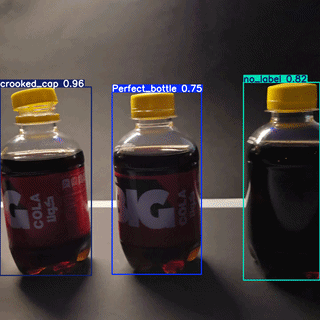
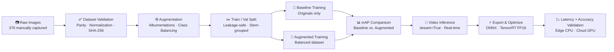
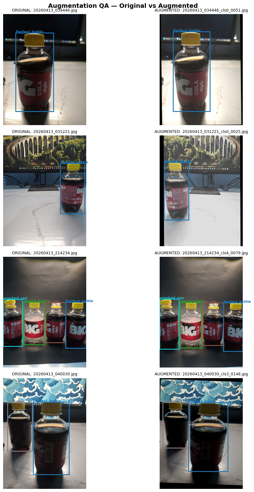
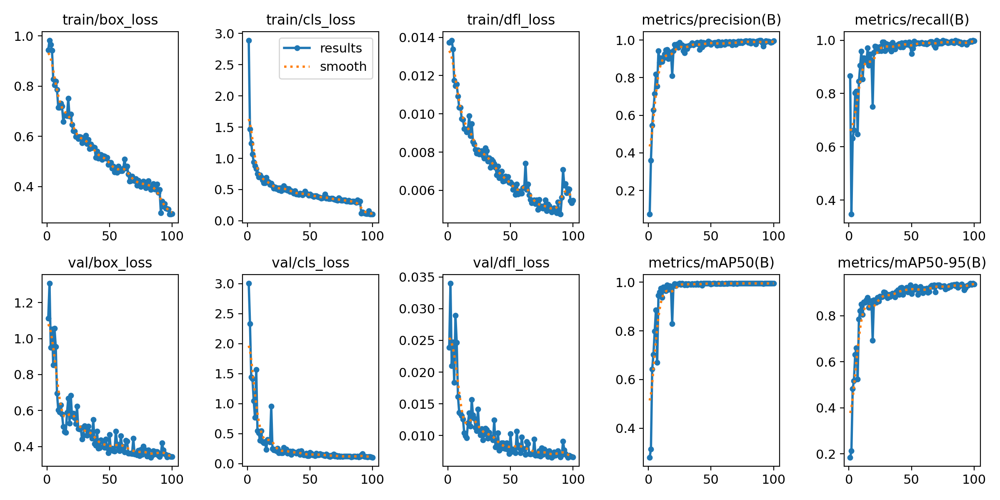
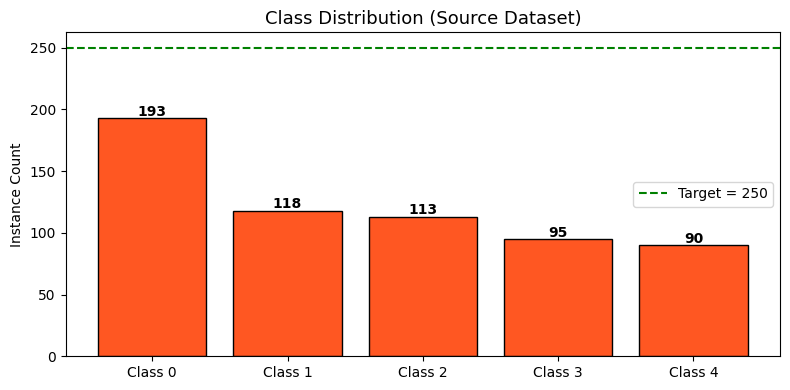
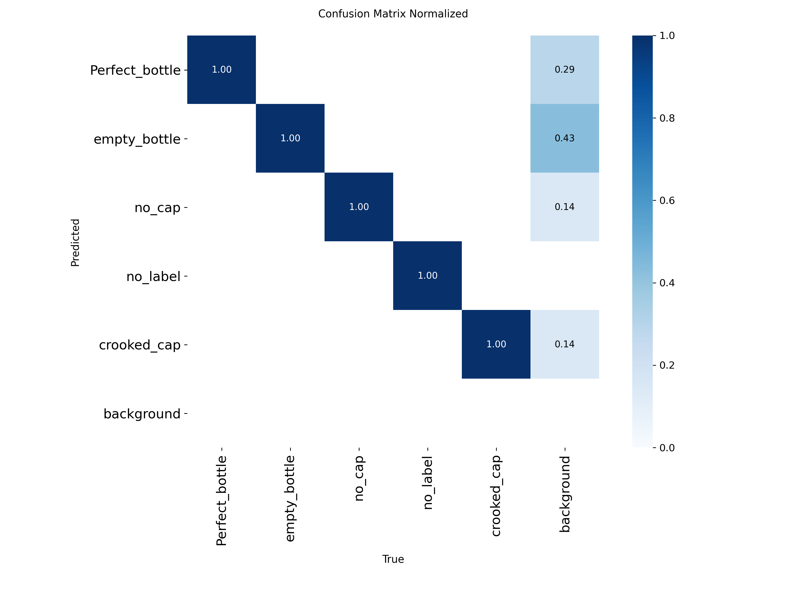

# 🍶 Big Cola — Industrial Bottle Quality Control Pipeline

A **production-grade Computer Vision pipeline** that detects and classifies **Big Cola bottle conditions** on a **simulated factory conveyor belt** using a custom-built dataset and **YOLO26n (Ultralytics)**.  
Built entirely from scratch: physical data collection, manual annotation, augmentation engineering, reproducible training experiments, real-time video inference, and multi-target inference optimization (ONNX + TensorRT).


![[YOLO26n]](https://img.shields.io/badge/YOLO26n-Object%20Detection-green)


---



---

## 📋 Table of Contents

1. [🚀 Why This Project](#why-this-project)
2. [🏗️ Pipeline Architecture](#pipeline-architecture)
3. [📁 Project Structure](#project-structure)
4. [📊 Key Features](#key-features)
5. [🔧 How It Works](#how-it-works)
6. [📦 Dataset](#dataset)
7. [📈 Results](#results)
8. [⚡ Optimization & Deployment Benchmarks](#optimization-benchmarks)
9. [🛠️ Requirements](#requirements)
10. [▶️ Quick Start](#quick-start)
11. [👤 Author](#author)

---

## 🚀 Why This Project <a name="why-this-project"></a>

Most student machine learning projects start with a downloaded dataset.  
This one started with a **trip to the supermarket**.

Building a real industrial quality-control system from zero means solving problems that tutorials never mention: inconsistent label formats, coordinate corruption during augmentation, stale output files silently poisoning training runs, and the challenge of simulating a factory environment with no factory access. It also means asking what happens *after* training finishes — a model that only runs well in a Colab notebook isn't production-ready, so this project pushes the trained model through two real deployment targets and measures the cost of getting there.

This project demonstrates how to:
- **Design and capture** a controlled industrial dataset from physical products
- **Engineer a robust pipeline** with validation gates, dataset fingerprinting, and reproducible experiments
- **Apply and validate** image augmentation without corrupting bounding box coordinates
- **Measure the real impact** of augmentation through a baseline vs. augmented training comparison
- **Run memory-efficient** real-time inference on video using `stream=True`
- **Optimize for deployment** across edge CPU and cloud GPU targets via ONNX and TensorRT FP16, with accuracy validated post-quantization — not just latency

Six critical pipeline bugs were encountered, diagnosed, and fixed during development. All six are documented in [`docs/engineering_debrief.md`](./docs/engineering_debrief.md).

---

## 🏗️ Pipeline Architecture <a name="pipeline-architecture"></a>



The pipeline is structured across **sequential phases**, each with its own validation layer before proceeding to the next — culminating in a deployment-optimization stage that validates both speed *and* accuracy on the final exported formats.

---

## 📁 Project Structure <a name="project-structure"></a>

```
bigcola-bottles-quality-control/
│
├── README.md                        ← You are here
├── Big_Cola_QualCtrl.ipynb          ← Full pipeline notebook (training + optimization, Google Colab)
├── big_cola.yaml                    ← YOLO dataset configuration
├── requirements.txt                 ← Pinned dependencies
├── model_card.json                  ← Model metadata, metrics, dataset hash
├── LICENSE                          ← MIT
├── .gitignore
│
├── models/
│   ├── best_bigcola.pt              ← PyTorch baseline weights
│   ├── best_bigcola.onnx            ← ONNX-exported weights
│   └── best_bigcola.fp16.onnx       ← ONNX-exported with half-precision
│   (TensorRT .engine intentionally not committed — see note below)
│
├── benchmarks/
│   ├── cpu_benchmark.py              ← Used python script to get cpu benchmark
│   └── optimization_benchmarks.csv   ← Raw benchmark results (all environments/formats)
│
├── docs/
│   ├── engineering_debrief.md       ← 7-entry post-mortem (6 pipeline bugs + optimization notes)
│   └── dataset_card.md              ← Dataset construction, classes, capture methodology
│
└── assets/
    ├── gif_inference.gif            ← Real-time conveyor belt inference demo
    ├── class_distribution.png      ← Class balance before and after augmentation
    ├── training_curves.png         ← Loss and mAP curves — main training run
    ├── training_curves_extended.png ← Extended training run curves
    ├── confusion_matrix.png        ← Validation confusion matrix
    └── augmented_samples.png       ← Side-by-side original vs. augmented examples
```

> **Note on the `.engine` file:** TensorRT engines are compiled for a specific GPU architecture and TensorRT version, so the file built on Colab's T4 isn't portable to other hardware. It's excluded via `.gitignore`; instead, the exact export command and environment versions are documented below so results are reproducible rather than just replayable.

---

## 📊 Key Features <a name="key-features"></a>

| Feature | Description |
|:---|:---|
| **End-to-End Ownership** 🔨 | Dataset designed, captured, and annotated entirely by the author — no pre-existing data used |
| **Industrial Simulation** 🏭 | Black paper background and tripod-controlled capture to replicate conveyor belt conditions |
| **Validation Gates** 🛡️ | Hard assertions on label parity, coordinate bounds, and class ID format before any training proceeds |
| **Dataset Fingerprinting** 🔑 | SHA-256 hash of the raw label directory stored in the model card — guarantees reproducibility |
| **Class Balancing** ⚖️ | Albumentations augmentation pipeline targets a minimum of 250 samples per class |
| **Controlled Experiments** 🔬 | Baseline (originals only) vs. augmented run — mAP delta measured and recorded |
| **Memory-Efficient Inference** 🎥 | `stream=True` generator pattern for real-time video inference without memory overflow |
| **Multi-Target Optimization** ⚡ | ONNX export for edge CPU + TensorRT FP16 for cloud GPU, each benchmarked independently |
| **Post-Quantization Validation** ✅ | Accuracy (mAP50-95) re-measured after FP16 quantization, not assumed unchanged |
| **7-Entry Post-Mortem** 📝 | All pipeline and optimization failures documented with root cause, diagnosis, and fix |

---

## 🔧 How It Works <a name="how-it-works"></a>

### Phase 1 — Dataset Validation
Before a single image is augmented or trained on, the pipeline verifies:
- Every image has a matching label file (parity check using set arithmetic on file stems)
- Every label file has valid YOLO coordinates within `[0, 1]`
- Class IDs are normalized from float strings (`4.0` → `4`) to prevent downstream parse failures
- A SHA-256 fingerprint is computed from all label files and stored for traceability

A hard assertion gate stops execution if any check fails.

### Phase 2 — Augmentation
Albumentations transforms are applied with YOLO-format bounding box passthrough — coordinates are never manually converted before passing to the library. Transform parameters are kept conservative to prevent coordinate clamping artifacts (see Bug 4 in [`engineering_debrief.md`](./docs/engineering_debrief.md)).

The `OUTPUT_DIR` is wiped completely before every run to enforce idempotency.



### Phase 3 — Train / Val Split
The split is grouped by **original image stem**. All augmented variants of a source image are always assigned to the same partition as their source, preventing label leakage between train and validation sets.

### Phase 4 — Training Experiments
Two sequential training runs are executed:
- **Baseline:** Trained on original images only — establishes the performance floor
- **Augmented:** Trained on the balanced augmented dataset — measures augmentation impact



### Phase 5 — Inference
The trained model processes the test video using `stream=True` for frame-by-frame generator-based inference, avoiding memory accumulation over long video sequences.

### Phase 6 — Optimization & Export
The best-performing (augmented) model is exported to two deployment targets:
- **ONNX** for lightweight, dependency-light edge CPU inference
- **TensorRT (FP16)** for maximum-throughput cloud GPU inference

Both exports are benchmarked for latency **and** re-validated for accuracy — quantization is treated as a tradeoff to measure, not assume away. See [Optimization & Deployment Benchmarks](#optimization-benchmarks) below.

---

## 📦 Dataset <a name="dataset"></a>

The dataset was built entirely from scratch using physical Big Cola bottles and a controlled capture setup.

| Property | Value |
|:---|:---|
| **Total images** | 376 |
| **Classes** | 5 |
| **Annotation format** | YOLO (normalized) |
| **Augmentation target** | 250 images per class |
| **Environment simulation** | Black paper background + tripod |

### Classes

| ID | Name | Description |
|:---|:---|:---|
| 0 | `Perfect_bottle` | No defects — correct cap, label, and fill |
| 1 | `empty_bottle` | No liquid content |
| 2 | `no_cap` | Cap missing |
| 3 | `no_label` | Label missing |
| 4 | `crooked_cap` | Cap misaligned or improperly sealed |



📥 **Full annotated dataset available on Kaggle:** https://www.kaggle.com/datasets/youssefeldemerdashh/big-cola-bottles-dataset-for-yolo-quality-control

For full dataset construction details, see [`docs/dataset_card.md`](./docs/dataset_card.md).

---

## 📈 Results <a name="results"></a>

| Run | Training Data | mAP50 | mAP50-95 | Precision | Recall |
|:---|:---|:---:|:---:|:---:|:---:|
| Baseline | Originals only (376 images) | 0.8788 | 0.8246 | 0.9203 | 0.9276 |
| Augmented | Balanced augmented dataset | 0.9950 | 0.9424 | 0.9899 | 0.9974 |



> Model metadata, dataset hash, and full metric details are in [`model_card.json`](./model_card.json).

---

## ⚡ Optimization & Deployment Benchmarks <a name="optimization-benchmarks"></a>

The augmented model (**YOLO26n** — 122 layers, 2.37M parameters, 5.2 GFLOPs, 640×640 input) was exported and benchmarked across two independent deployment targets to validate both **edge** and **cloud** production scenarios.

### Edge CPU — Intel Core i7-8550U

| Format | Precision | Mean Latency | Throughput | Result |
|:---|:---:|:---:|:---:|:---|
| PyTorch (baseline) | FP32 | 386.9 ms | 2.6 FPS | unoptimized baseline |
| **ONNX Runtime** | FP32 | **164.2 ms** | **6.1 FPS** | **57.5% faster** |

### Cloud GPU — NVIDIA T4 (Google Colab)

| Format | Precision | Metric | Value | Result |
|:---|:---:|:---|:---:|:---|
| PyTorch (baseline) | FP32 | Mean Latency | 13.95 ms | unoptimized baseline |
| PyTorch (baseline) | FP32 | Accuracy (mAP50-95) | 0.9540 | reference validation score |
| **TensorRT Engine** | **FP16** | Mean Latency | **5.61 ms** | **59.8% faster than GPU baseline** |
| **TensorRT Engine** | FP16 | P50 (Median) | 5.51 ms | typical real-world frame speed |
| **TensorRT Engine** | FP16 | P99 (Worst Case) | 8.82 ms | production-relevant latency ceiling |
| **TensorRT Engine** | FP16 | Accuracy (mAP50-95) | 0.9504 | **negligible 0.36% drop vs. baseline** |

**Why this matters:** FP16 quantization is a known accuracy risk, not a free win — mAP50-95 was re-measured on the exported engine rather than assumed unchanged, confirming the 59.8% latency gain came at a **0.36% accuracy cost**, not a hidden one. At 198+ effective FPS headroom, GPU inference is no longer the bottleneck for a conveyor-belt-speed use case; the binding constraint shifts to camera capture rate and upstream I/O.

**Reproducibility:**
- Export commands: `model.export(format='onnx')` and `model.export(format='engine', half=True, workspace=4)`
- Latency figures are mean/P50/P99 over repeated inference passes at batch size = 1, discarding initial warm-up iterations
- Full raw results: [`benchmarks/optimization_benchmarks.csv`](./benchmarks/optimization_benchmarks.csv)
- Environment: TensorRT 10.x, CUDA 12.x, Google Colab T4 GPU (cloud) / Intel Core i7-8550U (edge CPU)

---

## 🛠️ Requirements <a name="requirements"></a>

- Python 3.10+
- Ultralytics (YOLO26n)
- Albumentations ≥ 1.3.0
- OpenCV (`cv2`)
- ONNX Runtime
- TensorRT (for GPU export/benchmarking only — not required for CPU/ONNX inference)
- NumPy
- Matplotlib
- PyYAML
- tqdm

Install all dependencies:
```bash
pip install -r requirements.txt
```

> **Platform note:** This project was developed and trained on **Google Colab** with data stored on **Google Drive**. The notebook is fully self-contained — mount your Drive, update the path variables in the config cell, and run all cells sequentially. TensorRT benchmarking requires a CUDA-capable GPU (Colab T4 or equivalent); the ONNX/CPU benchmark can be reproduced on any machine.

---

## ▶️ Quick Start <a name="quick-start"></a>

### 1. Clone the Repository
```bash
git clone https://github.com/Demerdashh/bigcola-bottles-quality-control.git
cd bigcola-bottles-quality-control
```

### 2. Install Dependencies
```bash
pip install -r requirements.txt
```

### 3. Open in Google Colab
Upload `Big_Cola_QualCtrl.ipynb` to Google Colab and mount your Drive.

Update the config cell at the top of the notebook:
```python
DATA_DIR   = Path('/content/drive/MyDrive/YOUR_DATA_FOLDER')
OUTPUT_DIR = Path('/content/ed_data')
WEIGHTS_DIR = Path('/content/drive/MyDrive/YOUR_WEIGHTS_FOLDER')
```

### 4. Run the Pipeline
Execute cells sequentially — each phase validates before proceeding:
1. **Environment Setup** — installs dependencies, locks seed
2. **Dataset Validation** — parity checks, label normalization, SHA-256 fingerprint
3. **Augmentation** — generates balanced dataset in `OUTPUT_DIR`
4. **Train / Val Split** — leakage-safe split grouped by image stem
5. **Training & Evaluation** — baseline run → augmented run → mAP comparison
6. **Video Inference** — runs the trained model on your test video
7. **Optimization & Export** — exports to ONNX and TensorRT FP16, benchmarks latency and re-validates accuracy on each format

> If you hit a `FileNotFoundError` on the YAML path, your Colab runtime disconnected before the YAML cell saved. Re-run the YAML cell above the training cell first.

---

## 👤 Author <a name="author"></a>

Built with ❤️ by **Youssef El Demerdash**

- [LinkedIn](https://www.linkedin.com/in/youssef-eldemerdash-754674378/)
- [GitHub](https://github.com/Demerdashh)

---

*For pipeline failure analysis and lessons learned, see [`docs/engineering_debrief.md`](./docs/engineering_debrief.md)*  
*For dataset construction details, see [`docs/dataset_card.md`](./docs/dataset_card.md)*